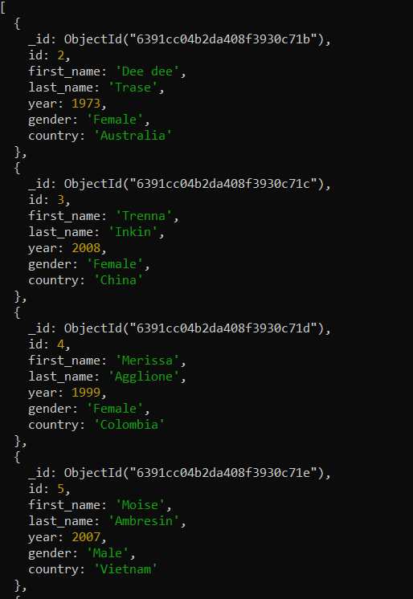
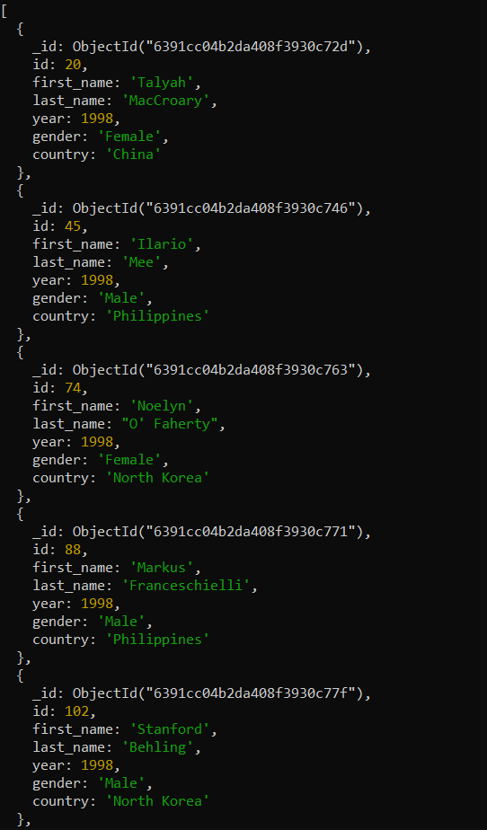
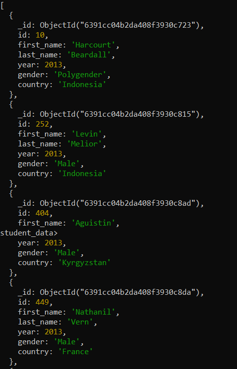
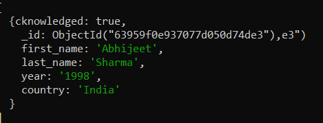
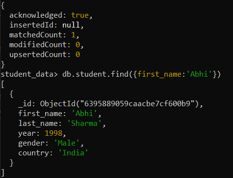
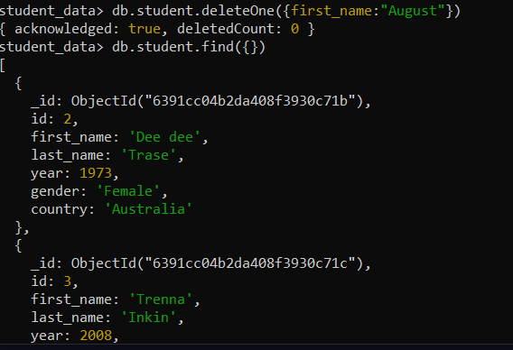
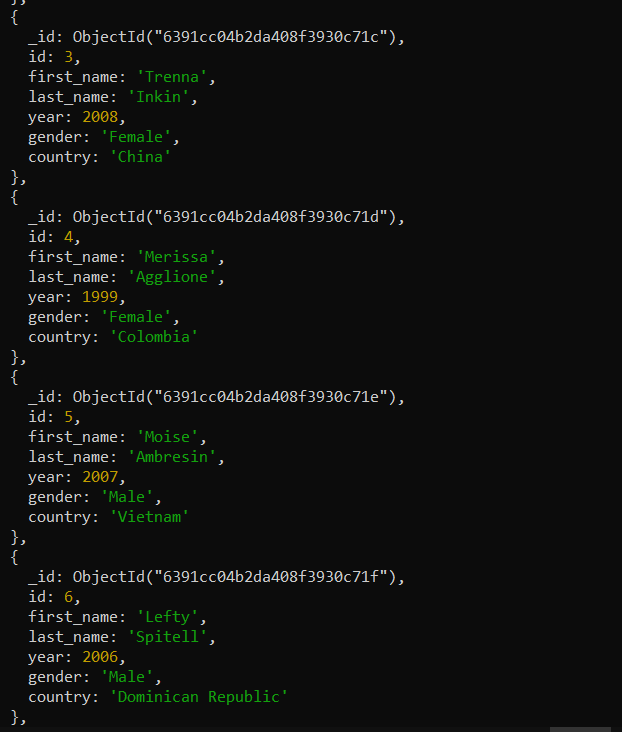
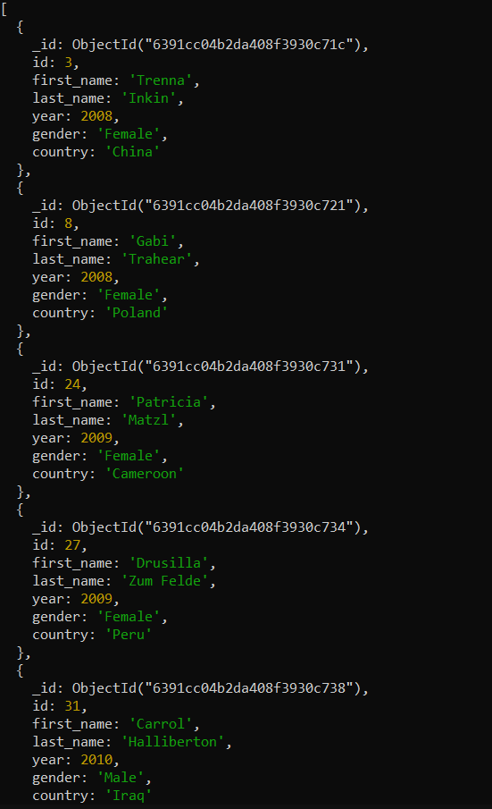
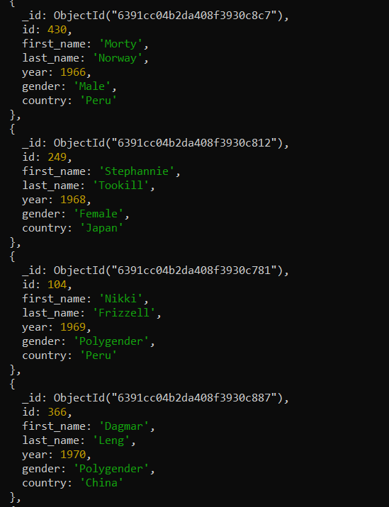
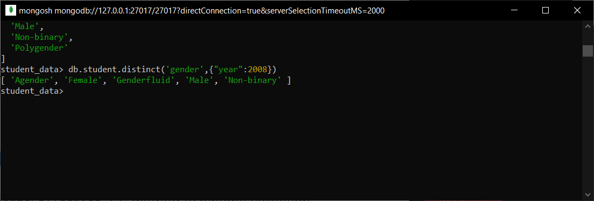

# Crework-Month-5-Week-2 Task

### Database Name: student_data

### Collection Name: student

## Queries:

### > 1. db.student.find({ })

### > 2. db.student.find({year:1998})

### 3. db.student.find({year:{$gt:2012})

### 4. db.student.find({first_name:'Abhijeet'})

### 5. db.student.updateOne({"last_name":"Sharma"},{ $set:{"first_name":"Abhi"}})

### 6. db.student.deleteOne({first_name:'August'})

### 7. db.student.find({gender:{$in:["Male","Female"]}})

### 8. db.student.find({ year: { $gt :2007, $lt:2011}})

### 9. db.student.find().sort({'year':1})

### 10. db.student.distinct('gender',{"year":2008})

